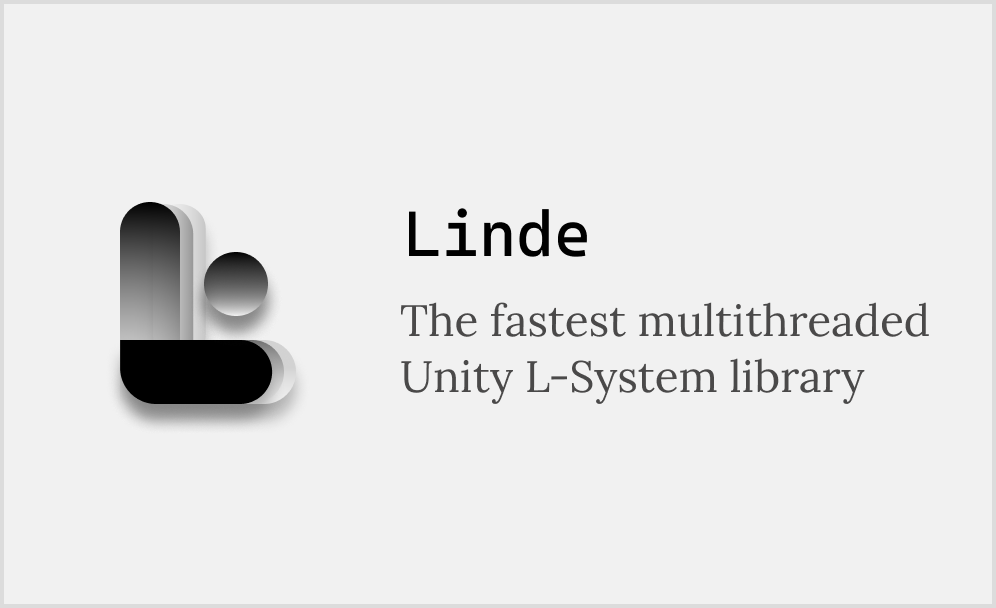

# Linde

Linde is a fastest Unity L-System Multi-Thread Library what can generate 1000000000 steps in 30 sec!

# Warning

Linde is still in the very early stages of development. APIs can and will change. Important features are missing.

# What are L-Systems?

You can check

1. [L-System wiki page](https://en.wikipedia.org/wiki/L-system)
2. ["Coding Train" video](https://www.youtube.com/watch?v=E1B4UoSQMFw)
3. ["Geoffrey Datema" video](https://youtu.be/egxBK_EGauM)
4. [Paul Bourke explanation](http://paulbourke.net/fractals/lsys/)

# Getting started

Windows :

Ubuntu :

# TODO

1. die
